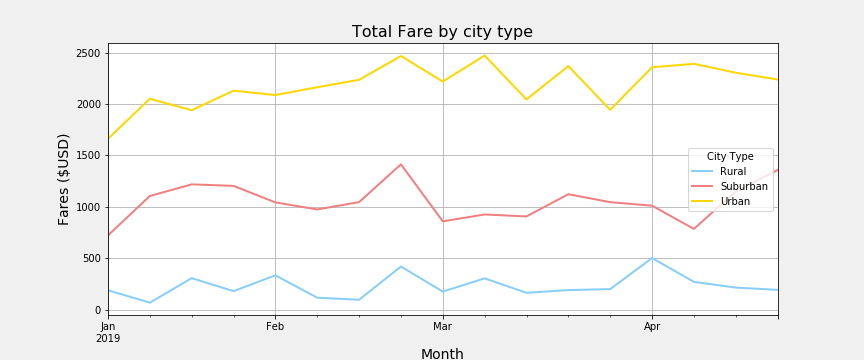

# PyBer_Analysis

Analysis of the ride and driver fare per city types

## Challenge

1. The summary table sums up the total number of rides, driver and revenue and the average fare per ride and driver for each city category. Based on the data we can conclude that the urban areas uses the service the most, having most of the rides and drivers. As a result of hight availability the ride fare is cheaper with driver gaining the least. On the oposite spectrum are the rural area. A lot number of rides and driver lead to more expensive rides and with driver having a higher income.

2. 
